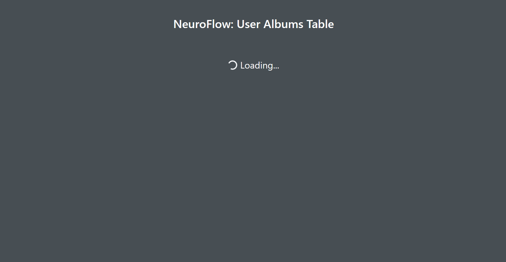

# Neuroflow: Coding Assessment

The objective of this project was to create a simple frontend application to pull data from a mock API and present it in a tabular format. Nullish values are replaced with a placeholder, and the table rendering is delayed until the API request is successfully completed.

## Setup

1. Clone the repository; Run: ```git clone https://github.com/nitishraju/neuroflow-project.git```

2. Navigate to the cloned directory and install necessary packages; Run: ```cd neuroflow-project``` and ```yarn install```

3. Run the project; Run: ```yarn start```

4. A window should open automatically. The localhost URL to the web app will also be displayed on the terminal used to run the commands.

## Tools Summary

This project uses the React.js framework to set up a state-based web app easily. 
Since the table is not displayed until the data is ready, React makes it easy to render something else until then.

React Bootstrap is also used in this project. The library provides easy access to aesthetically pleasant assets such as
the Spinner and Table components. This saves a large amount of time creating custom styling for each part of the web app.

ESLint is also used to enforce code style in the project, allowing for readability and consistency across the project's code.

## Demo

A GIF of the web app rendering the table after displaying the loading screen until the data is retrieved: 


